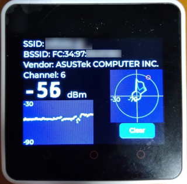

# APを見つけるツール

お遊びのツールなので，本格的な計測に使えるとは思わないこと．

## これは何？

こんな時に使う
* 目の前にWi-FiのAP設置されているが，SSID/BSSIDがわからないので調べたい
* APを設置したが，離れた場所で電波強度がどう見えるか調べたい
* SSIDが見えてるがAPがどこにあるかわからないので探したい

スマホによくあるWi-Fiアナライザ的なものではあるが，特定の1台のAPだけ追いたい場合に使う．スキャンではなくパケットキャプチャでRSSIを出しているので，リアルタイムにRSSIの変化を確認できる．

RSSIを表示した状態でウロウロ歩き回ることでAPを発見できる，かもしれない．




## 対象デバイスとビルド環境

M5Stack Core2 V1.1 & PlatformIO

手元にV1.1しかないので，それしか試していない．

## ビルド済バイナリ

formware_bin ディレクトリにビルド済みのバイナリがあるので，書き込みツールを使うことで書き込み可能．同ディレクトリにある，write_firmware.sh が，Linux上で書き込むためのスクリプト．シリアルポートとして /dev/ttyACM0 を使う前提になっているので，環境に応じてスクリプトを書き変えること．


## 制限

2.4GHzのAPのみ対応．5GHz対応のM5Stackが早く出て欲しい．

## 基本的な操作方法

1. scanボタンを押す
1. AP一覧が出てくるまで待つ
1. 詳細を見たいAPを長押しする
1. 詳細画面が出る
1. 右にスワイプして元の画面に戻る
1. 電源ボタンを押すとシャットダウン画面が出る
1. シャットダウンボタンの長押しで電源を切る

## 丸いグラフは何？

RSSIをプロットしたもの．電波が強く見える方角を探るためのグラフ．

(半分ジョークなので，お遊び程度に見ること．)

1. M5Stack本体をお腹の前にピッタリくっつけて持つ
1. 手元を揺らさないようにしながらClearボタンをタップ
1. その場でゆっくり1回転回る

人体を遮蔽材として使っているので，体が小さい人の場合はあまり向きによる差が出ない可能性あり．

ClearボタンをタップしたときにIMUのオフセットを調整しているので，フラフラ動かしながらタップすると回転角がおかしくなるので注意．動かないようにしっかり持った状態でタップする．


## ベンダ名のデータを最新のものにしたい

ouitableディレクトリに，Cのヘッダを作成するツールが格納されているので，そのディレクトリで
```shell
make clean
make
```
とすると，ouitable.h がそのディレクトリに作成される．そのファイルをsrc/にコピー(上書き)してリビルドする．


## 使用しているカスタムフォント

https://fonts.google.com/noto/specimen/Noto+Sans+Mono

https://hicchicc.github.io/00ff/

https://myrica.estable.jp/

